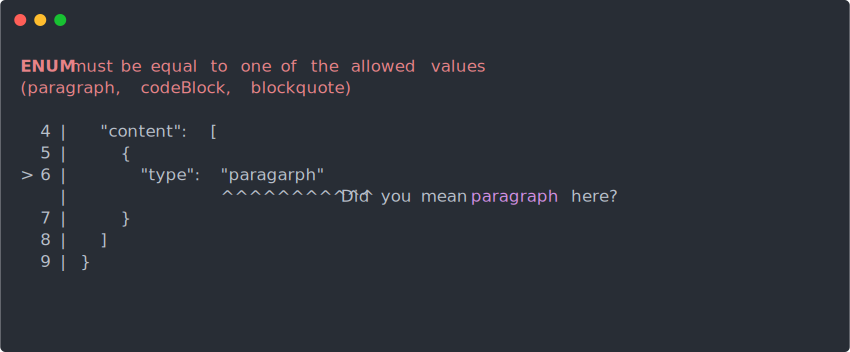

<h1 align="center">
  
  <br>
</h1>

> JSON Schema validation for Human 👨‍🎤

Main goal of this library is to provide relevant error messages like the following:

<p align="center">
  
</p>

## Fork

This fork removes the legacy build and thus drops dependencies such as `core-js`
and `@babel/runtime` which is not needed on modern installations.

- Node 12 and later supports the modern build and according to the release plan
  node 10 was EOL at 2021-04-30.
- Earlier versions is already EOL and not supported. Anyone using it should
  update instead.

The following PRs from upstream are merged:

- [PR-85: fix: enumeration in anyOf](https://github.com/atlassian/better-ajv-errors/pull/85)
- ~[PR-67: fix(typings): Correct TypeScript type definition](https://github.com/atlassian/better-ajv-errors/pull/67)~ (superseeded by upstream fix)
- ~[PR-70: Drop legacy build and dependecy on polyfills](https://github.com/atlassian/better-ajv-errors/pull/70)~ (dropped in favour of esbuild)

The following PRs has been merged upstream:

- [PR-84: feat: support `json` option to get accurate line/column listings](https://github.com/atlassian/better-ajv-errors/pull/84)
- [PR-92: feat: ajv 8 support](https://github.com/atlassian/better-ajv-errors/pull/92)

## Installation

```bash
$ npm i @sidvind/better-ajv-errors
```

Also make sure that you installed [ajv](https://www.npmjs.com/package/ajv) package to validate data against JSON schemas.

## Usage

First, you need to validate your payload with `ajv`. If it's invalid then you can pass `validate.errors` object into `better-ajv-errors`.

```js
import Ajv from 'ajv';
import betterAjvErrors from '@sidvind/better-ajv-errors';
// const Ajv = require('ajv');
// const betterAjvErrors = require('@sidvind/better-ajv-errors').default;
// Or
// const { default: betterAjvErrors } = require('@sidvid/better-ajv-errors');

// You need to pass `{ jsonPointers: true }` for older versions of ajv
const ajv = new Ajv();

// Load schema and data
const schema = ...;
const data = ...;

const validate = ajv.compile(schema);
const valid = validate(data);

if (!valid) {
  const output = betterAjvErrors(schema, data, validate.errors);
  console.log(output);
}
```

## API

### betterAjvErrors(schema, data, errors, [options])

Returns formatted validation error to **print** in `console`. See [`options.format`](#format) for further details.

#### schema

Type: `Object`

The JSON Schema you used for validation with `ajv`

#### data

Type: `Object`

The JSON payload you validate against using `ajv`

#### errors

Type: `Array`

Array of [ajv validation errors](https://github.com/epoberezkin/ajv#validation-errors)

#### options

Type: `Object`

##### format

Type: `string`  
Default: `cli`  
Values: `cli` `js`

Use default `cli` output format if you want to **print** beautiful validation errors like following:


Or, use `js` if you are planning to use this with some API. Your output will look like following:

```javascript
[
  {
    start: { line: 6, column: 15, offset: 70 },
    end: { line: 6, column: 26, offset: 81 },
    error:
      '/content/0/type should be equal to one of the allowed values: panel, paragraph, ...',
    suggestion: 'Did you mean paragraph?',
  },
];
```

##### indent

Type: `number` `null`  
Default: `null`

If you have an unindented JSON payload and you want the error output indented.

This option have no effect when using the `json` option.

##### json

Type: `string` `null`  
Default: `null`

Raw JSON payload used when formatting codeframe.
Gives accurate line and column listings.
